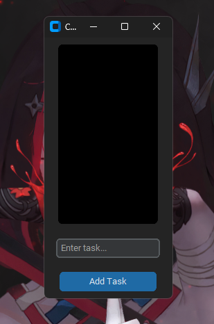

# Task List GUI Application

A simple and interactive task list application built with `Python` and `CustomTkinter` that allows users to add and remove tasks from a to-do list with smooth animations. It has a sleek, dark theme interface designed for ease of use and aesthetic appeal.

## Features

- **Add Tasks**: Quickly add tasks to your to-do list with the input field.
- **Remove Tasks**: Tasks can be removed with a cool fade-out animation when clicked.
- **Dark Mode**: Beautiful dark theme interface to reduce eye strain.
- **Customizable Appearance**: The application uses `CustomTkinter` for a modern, customizable look and feel.
- **Lightweight**: Lightweight and simple design to keep the focus on your task list.

## Screenshots



## Requirements

Before running the app, ensure that you have the following installed:

- Python 3.x or higher
- `tkinter` (comes pre-installed with Python)
- `customtkinter` (can be installed via pip)

You can install `customtkinter` using:

```bash
pip install customtkinter
